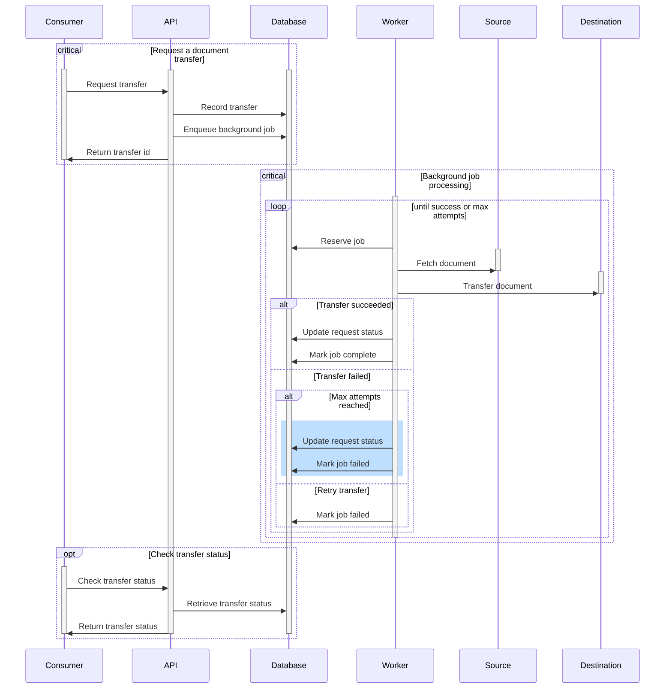

# Document Transfer Service API



Interacting with the Document Transfer Service is done through a RESTful API.
All requests and responses should be in JSON format, unless otherwise indicated.

See the [authentication] documentation for information on how to authenticate.

Full API documentation can be found in the [OpenAPI specification][spec].

## GET /health

A basic health endpoint that will return a 200 status code if the API is
running.

_Note: This endpoint does not require authentication._

Example response:

```json
{ "status": "ok" }
```

## POST /transfer

Initiate a document transfer. This is a synchronous request that will return
once the transfer is complete or a failure occurs.

The required parameters for this request will vary based on the [source] and
[destination] types.

Successful requests will always include a `status` and `destination` field.
Additional fields may be included based on the destination type.

### Example request

```json
{
  "source": {
    "type": "url",
    "url": "https://example.com/document.pdf"
  },
  "destination": {
    "type": "onedrive",
    "path": "/document/path"
  }
}
```

### Example response:

```json
{
  "status": "success",
  "destination": "onedrive",
  "path": "/document/path/document.pdf"
}
```

## Instrumentation

The following metrics are reported for each API call using the
`DocumentTransfer::API::Middleware::Instrument` middleware for rack.

| Metric Name                  | Description                                                |
|------------------------------|------------------------------------------------------------|
| `endpoint.requests.count`    | Counter incremented with each request to a valid endpoint. |
| `endpoint.requests.duration` | Request duration, in milliseconds, for valid endpoints.    |

## Logging

All requests are logged using the `DocumentTransfer::API::Middleware::Logger`
middleware for rack. The logger utilizes [semantic logging][semantic_logger] in
JSON format to provide easily parsable log entries.

[authentication]: ./api/authentication.md
[destination]: ./api/destinations.md
[semantic_logger]: https://logger.rocketjob.io/
[source]: ./api/sources.md
[spec]: https://github.com/codeforamerica/document-transfer-service/blob/main/openapi.yaml
