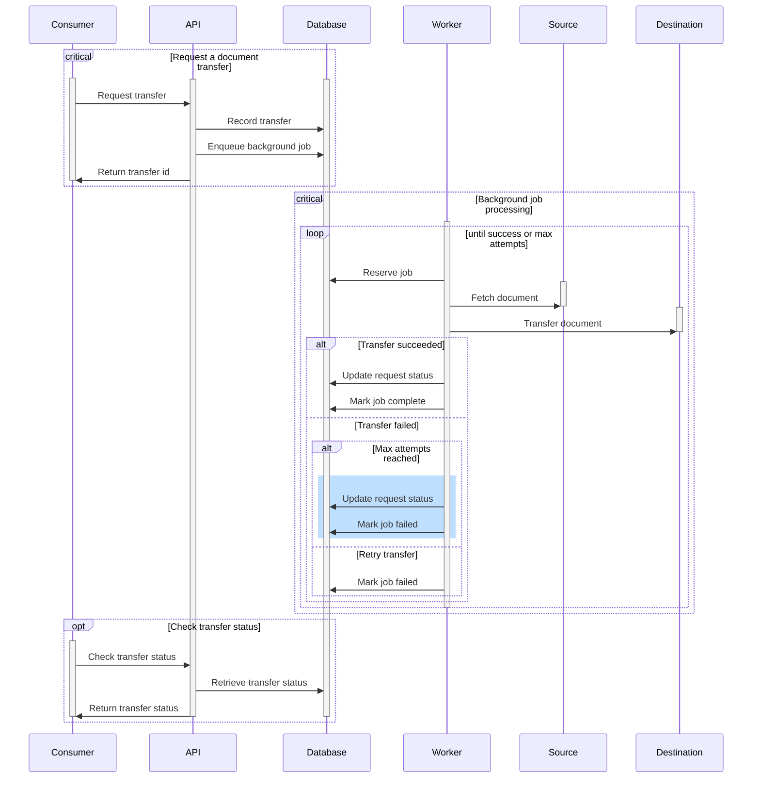

# Architecture

The Document Transfer Service is designed to be as lightweight as possible. As
such, we have chosen to use [grape] as the API framework. Grape is simple
microservice framework for ruby. It's opinionated, but less so than Rails, with
minimal dependencies.

## System Context

Although the exposed APIs are meant to be simple and generic, and could
therefore be used by any system, the primary use case is to support the
application process for benefits within America's [safety net]. As such, we'll
use this as our context for system documentation.

Within this larger system, the Document Transfer Service acts as a component
dedicated to the secure transfer of documents between the applicant and the
benefits system. This could be a state run system, or a third party system
authorized to process benefits applications.

```plantuml
!include https://raw.githubusercontent.com/plantuml-stdlib/C4-PlantUML/master/C4_Container.puml

title Document Transfer Service - System Context
AddRelTag("optional", $textColor="gray", $lineColor="gray", $lineStyle = DashedLine())

Person(applicant, "Applicant")
System_Ext(benefits_app, "Benefits Application", "Digital application for benefits")
System(doc_transfer, "Document Transfer Service", "A microservice to securely transfer documents")
System_Ext(benefits_system, "Benefits System", "System that processes benefits applications")

Rel_R(applicant, benefits_app, "Applies")
Rel_R(benefits_app, doc_transfer, "Requests document transfer")
Rel_D(doc_transfer, benefits_system, "Sends")
Rel(benefits_app, benefits_system, "Submits", $tags="optional")
Rel(benefits_system, applicant, "Notifies", $tags="optional")

footer Last updated 2024-09-04 for Document Transfer Service v1.0.0
```

The benefits application is typically a web form application that simplifies the
benefits application process for the application. The application will upload
their required documents to this system, which will then make an API call to
the Document Transfer Service to transfer the documents to the appropriate
destination. Typically, this call will be done asynchronously, so the applicant
is not waiting for the transfer to complete.

## The application

The application can be broken down into three [containers][c4-containers]:

- The [**API**][api] that handles the requests
- The [**worker**][worker] that processes background jobs
- The **database** that stores the transfer requests

```plantuml
!include https://raw.githubusercontent.com/plantuml-stdlib/C4-PlantUML/master/C4_Container.puml

title Document Transfer Service - Container Diagram
AddRelTag("optional", $textColor="gray", $lineColor="gray", $lineStyle = DashedLine())

Person(applicant, "Applicant")
System_Ext(benefits_app, "Benefits Application", "Digital application for benefits")
System_Ext(benefits_system, "Benefits System", "System that processes benefits applications")

System_Boundary(doc_transfer, "Document Transfer Service") {
  Container(api, "API", "Handles incoming requests")
  ContainerQueue(worker, "Worker", "Processes document transfers")
  ContainerDb(postgres, "PostgreSQL", "Stores transfer requests")

  Rel(api, postgres, "Record and queue transfer requests")
  Rel(worker, postgres, "Process background jobs")
}

Rel_R(applicant, benefits_app, "Applies")
Rel_D(benefits_app, api, "Requests document transfer")
Rel_L(worker, benefits_system, "Sends")
Rel(benefits_app, benefits_system, "Submits", $tags="optional")
Rel_U(benefits_system, applicant, "Notifies", $tags="optional")

footer Last updated 2024-09-04 for Document Transfer Service v1.0.0
```

### API

The API is the entry point for the service. It handles incoming requests,
records them in the database, and queues the transfer job for the worker to
process.

See the [API Architecture][api] for more details.

### Worker

The worker is responsible for processing the background jobs. It reads the
job queue from the database and processes jobs as they are available. Transfer
jobs are responsible for retrieving the source document and transferring it to
the destination.

See the [Worker Architecture][worker] for more details.

### Database

!!! warning "Sensitive Data Warning"

    While the service does not intend to store any PII (Personally
    Identifiable Information) or other sensitive data, any data passed in the source
    and destination parameters will be stored until the transfer has completed.

The Document Transfer service is designed to work with a [PostgreSQL] database.
Other database backends may work, but only the PostgreSQL drivers are included.

The database is used to store consumer details -- such as name and
authentication keys -- and the transfer requests. The service _does not_ store
or otherwise handle the contents of the documents being transferred.

Request data is stored in two pieces: the request itself and the background job
that performs the transfer. This allows the service to track the status of
transfers, while retaining the source and destination information for a minimum
length of time as jobs are deleted once they have been completed.

See the [database] documentation for more details on how the database is
configured.



[api]: architecture/api.md
[c4-containers]: https://c4model.com/#ContainerDiagram
[database]: database.md
[grape]: https://github.com/ruby-grape/grape
[Postgresql]: https://www.postgresql.org/
[safety net]: https://codeforamerica.org/programs/social-safety-net/
[worker]: architecture/worker.md
