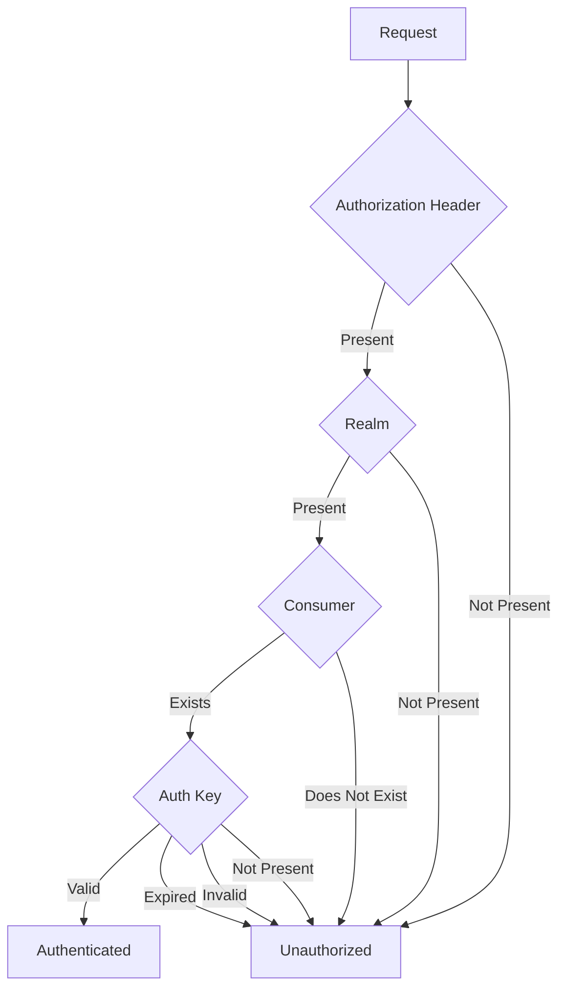

# API Architecture

The Document Transfer Service is designed to be as lightweight as possible. As
such, we have chosen to use [grape] as the API framework. Grape is simple
microservice framework for ruby. It's opinionated, but less so than Rails, with
minimal dependencies.

# Components

The API can be broken down into the following components:

* **Rack**: HTTP server
* **Auth**: Authentication
* **Grape**: API framework
* **Endpoint**: API endpoint controller
* **Job**: Document transfer job
* **Sequel**: Database ORM

```plantuml
!include https://raw.githubusercontent.com/plantuml-stdlib/C4-PlantUML/master/C4_Component.puml

title Document Transfer Service - Component Diagram
AddRelTag("optional", $textColor="gray", $lineColor="gray", $lineStyle = DashedLine())
AddBoundaryTag("system", $borderColor="#1168bd", $fontColor="#1168bd", $bgColor="transparent")
AddBoundaryTag("container", $borderColor="#438dd5", $fontColor="#438dd5", $bgColor="transparent")

System_Ext(benefits_app, "Benefits Application", "Digital application for benefits")
System_Ext(benefits_system, "Benefits System", "System that processes benefits applications")

System_Boundary(doc_transfer, "Document Transfer Service", $tags="system") {
  Container_Boundary(api, "API", $tags="container") {
    Component(rack, "Rack", "HTTP server")
    Component(auth, "Auth", "Authentication")
    Component(grape, "Grape", "API framework")
    Component(endpoint, "Endpoint", "API endpoint controller")
    Component(job, "Job", "Document transfer job")
    Component(sequel, "Sequel", "Database ORM")

    Rel_D(rack, auth, "Authorizes")
    Rel_R(rack, grape, "Routes")
    Rel_D(grape, endpoint, "Handles")
    Rel_R(endpoint, job, "Queues")
    Rel(endpoint, sequel, "Records")
    Rel(job, sequel, "Queues")
    Rel(auth, sequel, "Verifies")
  }

  ContainerQueue(worker, "Worker", "Processes document transfers")
  ContainerDb(postgres, "PostgreSQL", "Stores transfer requests")

  Rel_R(sequel, postgres, "Read/Write")
  Rel_D(worker, postgres, "Process background jobs")
}

Rel_D(benefits_app, rack, "Requests document transfer")
Rel_R(benefits_app, benefits_system, "Submits", $tags="optional")
Rel_U(worker, benefits_system, "Sends")

footer Last updated 2024-09-04 for Document Transfer Service v1.0.0
```

## Rack

[Rack] is a minimal interface between web servers supporting Ruby and Ruby
frameworks. It is used by Grape to handle incoming HTTP requests.

Additionally, Rack is responsible for inserting our middleware into the request.
This middleware is used to handle common tasks such as logging, error handling,
and authentication.

### Middleware

!!! warning "Middleware Loading Order"

    The middleware is loaded in the order it is defined in the `config.ru` file.
    This is important as the order can affect how the middleware interacts with
    the request.

    For example, the `CorrelationId` and `RequestId` middleware should be loaded
    before the `RequestLogging` middleware to ensure these ids are available.

The following middleware is used by the API:

* **AuthKey**: Handles authentication for restricted endpoints.
* **CorrelationId**: Adds a correlation ID to the request headers for logging
  and tracing, if not already present. This id will be passed to requests made
  to other systems.
* **Instrument**: Custom StatsD instrumentation for the API.
* **OpenTelemetry::Instrumentation::Rack::Instrumentation**: Instrumentation
  for [OpenTelemetry].
* **Rack::RewindableInput::Middleware**: Rewinds the input stream so it can be
  read multiple times.
* **RequestId**: Adds a unique request ID to the request headers for logging
  and tracing.
* **RequestLogging**: [Semantic logging][semantic-logger] of incoming requests.

## Auth

!!! warning "Key Expiration"

    Auth keys will authmatically expire after 90 days. This is to ensure that
    keys are rotated regularly and to prevent unauthorized access.

    It is important to keep track of key expiration dates and to create new keys
    before the old ones expire in order to prevent service interruptions.

!!! note "Permissions"

    Although multiple Consumer's and auth keys can be created, the API lacks
    the ability to restrict access to specific endpoints, sources, or
    destinations. All endpoints are accessable to all Consumers with a valid
    key.

Authentication is handled by the `AuthKey` middleware. This middleware checks
the `authorization` header for a valid `realm` and API key.

In order to authenticate, the following conditions mut be met:

1. The `authorization` header must be present
1. The `realm` must be a UUID that matches a Consumer record in the database
1. The API key must match an active, non-expired key for the Consumer



See the [authentication] documentation for more details on authenticating as a
consumer.

## Grape

[Grape] is simple microservice framework for ruby. It's opinionated, but less
so than Rails, with minimal dependencies.

The application for the API is defined in `DocumentTransfer::API::API`. This
class is responsible for defining global settings for the API, such as the
supported formats, error handling, and [OpenAPI] documentation.

Endpoints are mounted by the application, where grape will handle routing the
request to the appropriate endpoint.

## Endpoint

Endpoints are where the API logic is defined. Each endpoint is responsible for
handling a specific set of requests related to their domain. For example, the
`/transfer` endpoint is responsible for initiating a document transfer (`POST`)
and retrieving the status of a transfer (`GET`).

Currently available endpoints are:

* **`DocumentTransfer::API::Health`**: System health checks
* **`DocumentTransfer::API::Transfer`**: Document transfer requests

## Job

!!! danger "Work in Progress"

    This functionality is still a work in progress and is not yet implemented.

    Requests are currently processes synchronously, blocking the caller, and
    without built-in retries.

Jobs are tasks that are queued for background processing. In the case of the
API, jobs are used to process document transfers. When a transfer request is
received, a job is created and queued for the worker to process.

This job is responsible for retrieving the source document and transferring it
to the destination. It handles retries with exponential backoff, logging, and
error handling. This allows for a more resilient system that can recover from
temporary failures at either the source or destination.

For more information on jobs, see the [Jobs Architecture][jobs] documentation.

## Sequel

[Sequel] is a simple, flexible, and powerful SQL database access toolkit for
Ruby. It is used by the API to interact with the database without having to
write raw SQL queries.

[authentication]: ../api/authentication.md
[grape]: https://github.com/ruby-grape/grape
[jobs]: jobs.md
[openapi]: https://www.openapis.org/
[opentelemetry]: https://opentelemetry.io/
[rack]: https://github.com/rack/rack
[semantic-logger]: https://logger.rocketjob.io/
[sequel]: https://sequel.jeremyevans.net/
[statsd]: https://github.com/statsd/statsd
